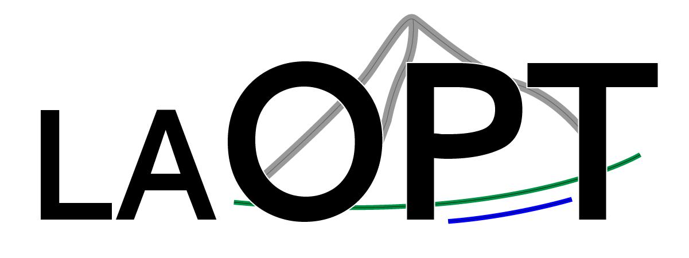

# laOPT

<p align="center">
  
</p>

[](LICENSE)
[-90e3dc.svg)](https://nccr-automation.ch/)
[](https://predict-epfl.github.io/laopt/)

laOPT is a native C++ toolbox for high-performance nonlinear optimization and optimal control. It provides a compact, vector-valued modeling interface and transcribes user-defined problems into sparse nonlinear programs of the form

$$
\begin{aligned}
\min_{\xi} \quad & \phi(\xi) \\
\text{s.t.} \quad & c(\xi) = 0, \\
& \xi_{\mathrm{lb}} \leq \xi \leq \xi_{\mathrm{ub}}, \\
& h_{\mathrm{lb}} \leq h(\xi) \leq h_{\mathrm{ub}}.
\end{aligned}
$$

For optimal control applications, laOPT also provides a high-level continuous-time problem interface and direct transcription methods.

## Features

- Header-only C++17 library built on [Eigen](https://eigen.tuxfamily.org/).
- Vector-valued modeling of objectives, dynamics, bounds, and constraints.
- Automatic gradients, Jacobians, and Hessians using Eigen, with optional [CasADi](https://web.casadi.org/) support.
- Sparse derivative assembly using precomputed sparsity patterns and evaluation tapes.
- Multiple shooting and Legendre-Gauss-Radau collocation for optimal control problems.
- A native sequential quadratic programming (SQP) solver and an interface to [IPOPT](https://github.com/coin-or/Ipopt).
- Interfaces to established QP solvers, including [PIQP](https://github.com/PREDICT-EPFL/piqp), [OSQP](https://github.com/osqp/osqp), [ProxQP](https://github.com/Simple-Robotics/proxsuite), [QPALM](https://github.com/kul-optec/QPALM), [qpSWIFT](https://github.com/qpSWIFT/qpSWIFT), and [HPIPM](https://github.com/giaf/hpipm).
- Open source under the BSD 2-Clause License.

## Installation

laOPT requires a C++17 compiler, CMake 3.21 or later, and Eigen 3.4 or later. Clone and install the header-only package with

```shell
git clone https://github.com/PREDICT-EPFL/laopt.git
cd laopt
cmake -S . -B build \
      -DLAOPT_BUILD_TESTS=OFF \
      -DLAOPT_BUILD_EXAMPLES=OFF
cmake --build build
cmake --install build
```

To use an installed copy from CMake:

```cmake
find_package(laopt REQUIRED)
target_link_libraries(my_target PRIVATE laopt::laopt)
```

Alternatively, add laOPT directly to a project:

```cmake
add_subdirectory(path/to/laopt)
target_link_libraries(my_target PRIVATE laopt::laopt)
```

The `laopt::laopt` target provides the core library and Eigen dependency. Solver interfaces are selected by including the corresponding laOPT header and linking the solver package explicitly in the consuming project.

For example, an application using the laOPT SQP solver with PIQP should link both targets:

```cmake
find_package(laopt REQUIRED)
find_package(piqp REQUIRED)

add_executable(my_target main.cpp)
target_link_libraries(my_target PRIVATE
    laopt::laopt
    piqp::piqp
)
```

The application can then select PIQP as its SQP subproblem solver:

```cpp
#include <laopt/laopt.hpp>
#include <laopt/solvers/sqp_solver.hpp>
#include <laopt/solvers/piqp_interface.hpp>

using Solver = laopt::SQPSolver<Problem, laopt::PIQPSolver<Problem::scalar_t>>;
```

The same pattern applies to IPOPT and the other QP solver interfaces.

## Examples

The [`examples`](examples) directory contains optimal control problems based on a double integrator, inverted pendulum, chain of masses, fixed-wing aircraft, and rocket. To build laOPT's examples, configure with `-DLAOPT_BUILD_EXAMPLES=ON` together with the `LAOPT_WITH_*` options for the locally available solver packages.

## Credits

laOPT is developed by Johannes Waibel, Roland Schwan, and Colin N. Jones at the [Automatic Control Laboratory](https://www.epfl.ch/labs/la/) at [EPFL](https://www.epfl.ch/), Switzerland.

This work was supported by the Swiss National Science Foundation under the [NCCR Automation](https://nccr-automation.ch/) (grant agreement 51NF40_225155).

## Citing laOPT

If you use laOPT in scientific work, please cite the accompanying paper:

```
@INPROCEEDINGS{waibel2026laopt,
  author={Waibel, Johannes, and Schwan, Roland and Jones, Colin N.},
  booktitle={2026 IEEE Conference on Control Technology and Applications (CCTA)}, 
  title={{laOPT}: A Native {C++} Optimal Control Toolbox for High-Performance Implementations, and Application to Racing}, 
  year={2026}
}
```

## License

laOPT is licensed under the [BSD 2-Clause License](LICENSE).
